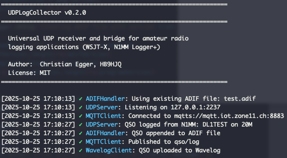

# UDPLogCollector
Simple UDP receiver and bridge for QSO data from logging applications like WSJT-X and N1MM Logger+.

UDPLogCollector acts as a centralized hub for amateur radio logging software, receiving QSO data via UDP and distributing it to multiple destinations. The primary use case is multi-operator contest weekends or field day operations where different logging and SDR tools need centralized logging in the background.



## Features (planned)

- Save QSOs to local ADIF file (simple log collector) ✅
- Send QSOs to MQTT broker (secured) ✅
- Send QSOs to Wavelog (https://www.wavelog.org) ✅
- Send QSOs to REST API (Node-RED)
- Send QSOs to a database (SQLite, MySQL/MariaDB)

## Installation

### Requirements
- **Node.js** >= 14.0.0
- **npm** (included with Node.js)

### Optional Requirements for Publishing
- **MQTT Broker** - For MQTT publishing (e.g., Mosquitto, HiveMQ, EMQX)
- **Wavelog Instance** - For Wavelog integration (self-hosted or club/cloud)
  - Wavelog API token
  - Station profile ID

### Installation Steps
1. **Clone or download the repository**  
   Open a terminal in the project directory (where `package.json` is located).
2. **Install dependencies**  
   This step is mandatory before running the application:
   
    ```bash
    npm install
    ```
3. **Run UDPLogCollector**  
   First, start with no options:
   
    ```bash
    node index.js
    ```

For detailed usage and configuration options, see `USAGE.md`.

## Supported Applications

Any logging software or SDR application that supports the UDP protocols from:
- **WSJT-X** (binary protocol) - e.g., WSJT-X, JTDX, JS8Call
- **N1MM Logger+** (text-based ADIF protocol) - e.g., N1MM Logger+, compatible contest loggers

### Other Tested Applications
- SmartSDR for Mac
- RUMLogNG
- MacLoggerDX

## Contributing

Pull requests are welcome. For major changes, please open an issue first to discuss what you would like to change.

## Support

For issues and questions, please open an issue on GitHub.
